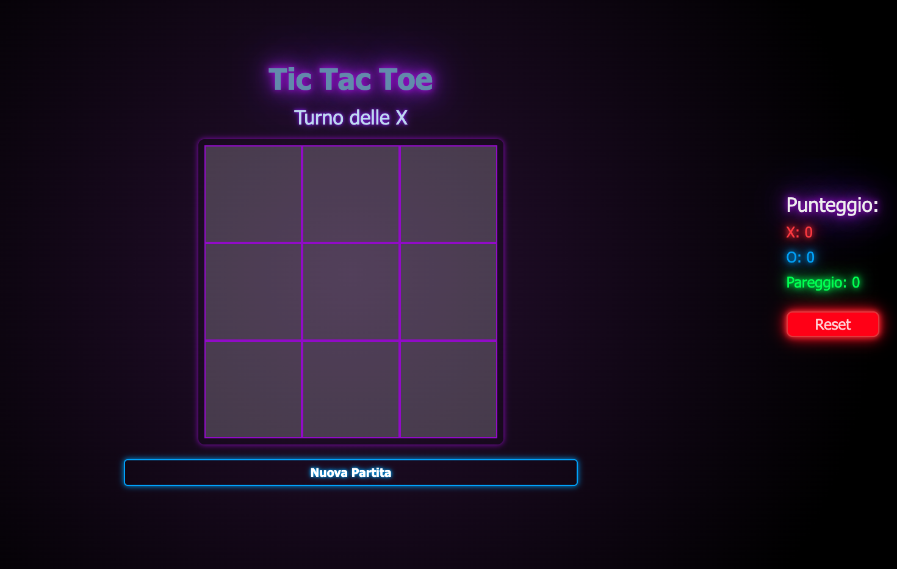

# Tic Tac Toe - Vue.js

## Descrizione
Questa applicazione è una riproduzione digitale del classico gioco del Tris (Tic Tac Toe). Il progetto è stato realizzato come esercitazione su Vue.js.

## Funzionalità
- 🎮 Modalità a due giocatori
- 🏆 Tracciamento del punteggio
- 🔄 Reset della partita
- 📱 Responsive design per una corretta visualizzazione su tutti i dispositivi
- 🖼️ OpenGraph per una corretta anteprima nei social

## Tecnologie Utilizzate
- **HTML**: Struttura della pagina
- **JavaScript**: Logica dell’applicazione
- **Vue.js**: Framework principale
- **CSS**: Stile e design
- **Bootstrap**: Stile e layout responsive
- **Git**: Versionamento del codice
- **GitHub Pages**: Deploy dell'applicazione online

## Installazione e utilizzo
1. **Clonare il repository**
   ```bash
   git clone https://github.com/fabiocambula/TicTacToe.git
   ```
2. **Accedere alla cartella del progetto**
   ```bash
   cd TicTacToe
   ```
3. **Installare le dipendenze**
   ```bash
   npm install
   ```
4. **Avviare l’app in locale**
   ```bash
   npm run dev
   ```
5. **Build per la produzione**
   ```bash
   npm run build
   ```

## Link al Progetto
🔗 [Gioca a Tic Tac Toe](https://fabiocambula.github.io/TicTacToe/)

## Screenshot


## Autore
👨‍💻 **Fabio Cambula**
